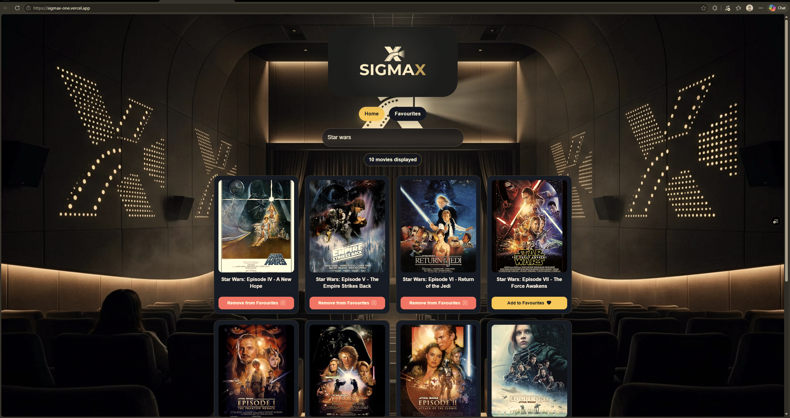
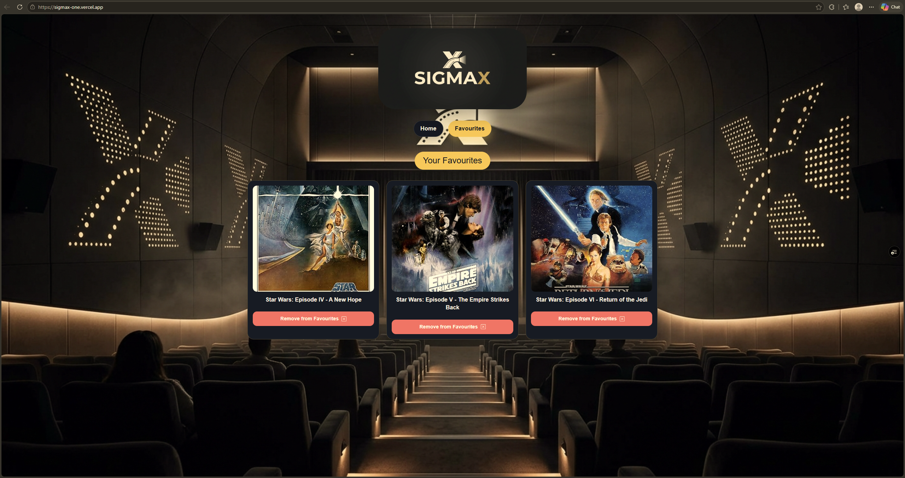

# Sigmax | Movie Browser

Sigmax is a responsive movie search and tracking application powered by the OMDb API.

It allows users to search for movies in real time, view details and posters, and manage a custom list of personal favourites that persists across browser sessions using local storage.

## System Preview

### Home Page

### Favourites Page

## Live Demo

- Ctrl + click link
- <a href="https://sigmax-one.vercel.app/" target="_blank" rel="noopener noreferrer">Click <u>Here</u> for live demo.</a>

## Features

- **Real-Time Movie Search**: Instant movie fetching via the OMDb API.
- **Title Filtering**: Automatic query matching to deliver accurate search results.
- **Favourites Management**: Easily add or remove movies from your personal collection.
- **Persistent Storage**: Saved favourites persist across sessions using `localStorage`.
- **Dynamic Views**: Tabbed navigation switching seamlessly between Search Results and Favourites.
- **Fallback Handling**: Safe poster fallbacks for missing images and graceful error messaging for invalid searches.
- **Accessible UI**: Interactive buttons equipped with custom `aria-label` attributes for accessibility.

## Tech Stack

- React
- Vite
- JavaScript
- CSS3
- OMDb API
- Vitest / Testing Library _(if implemented)_
- ESLint
